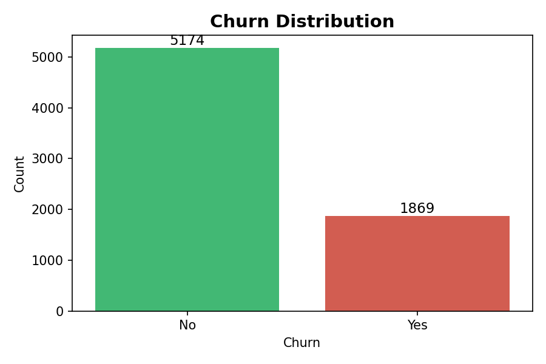
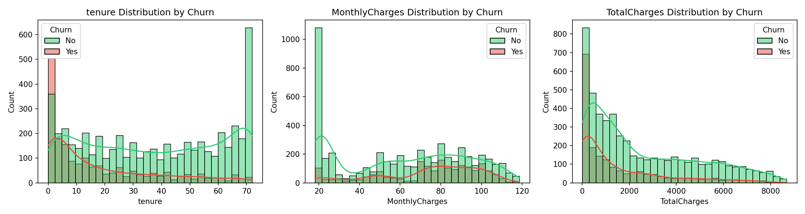
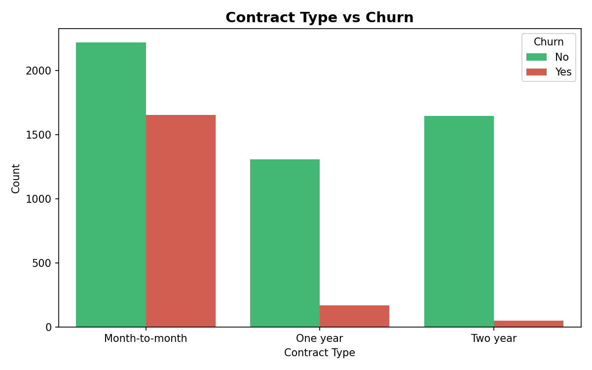
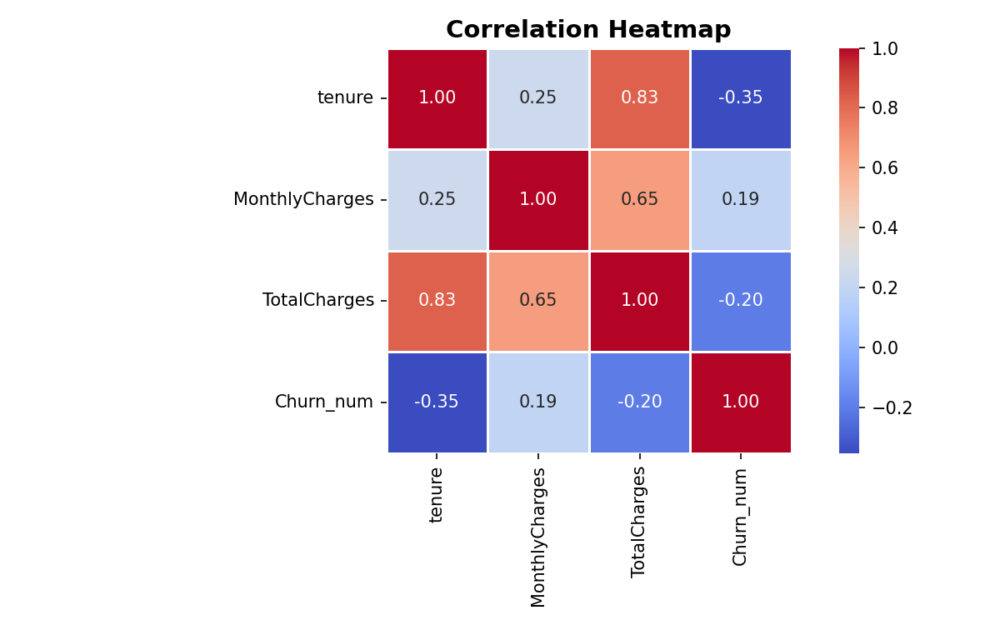
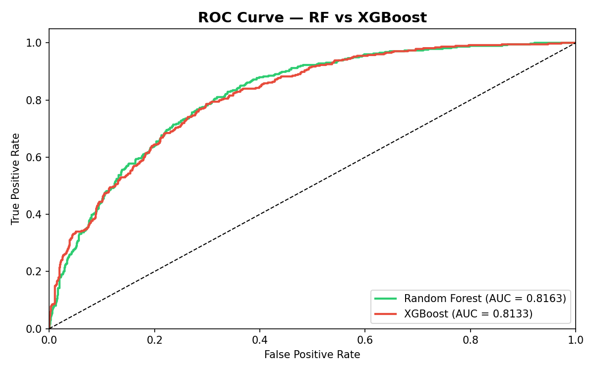
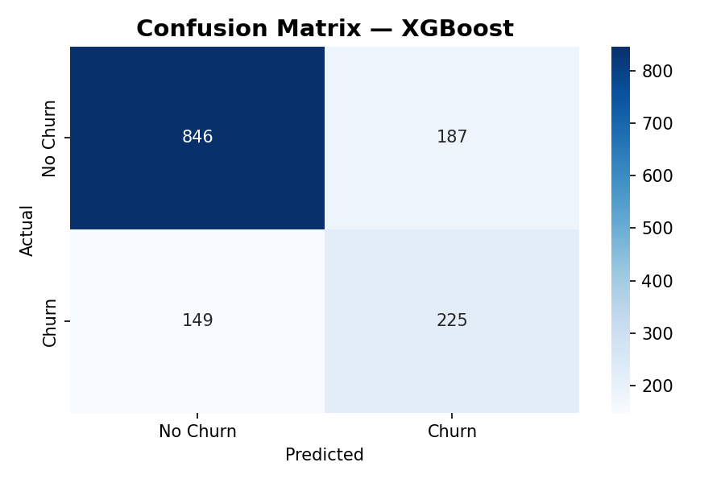
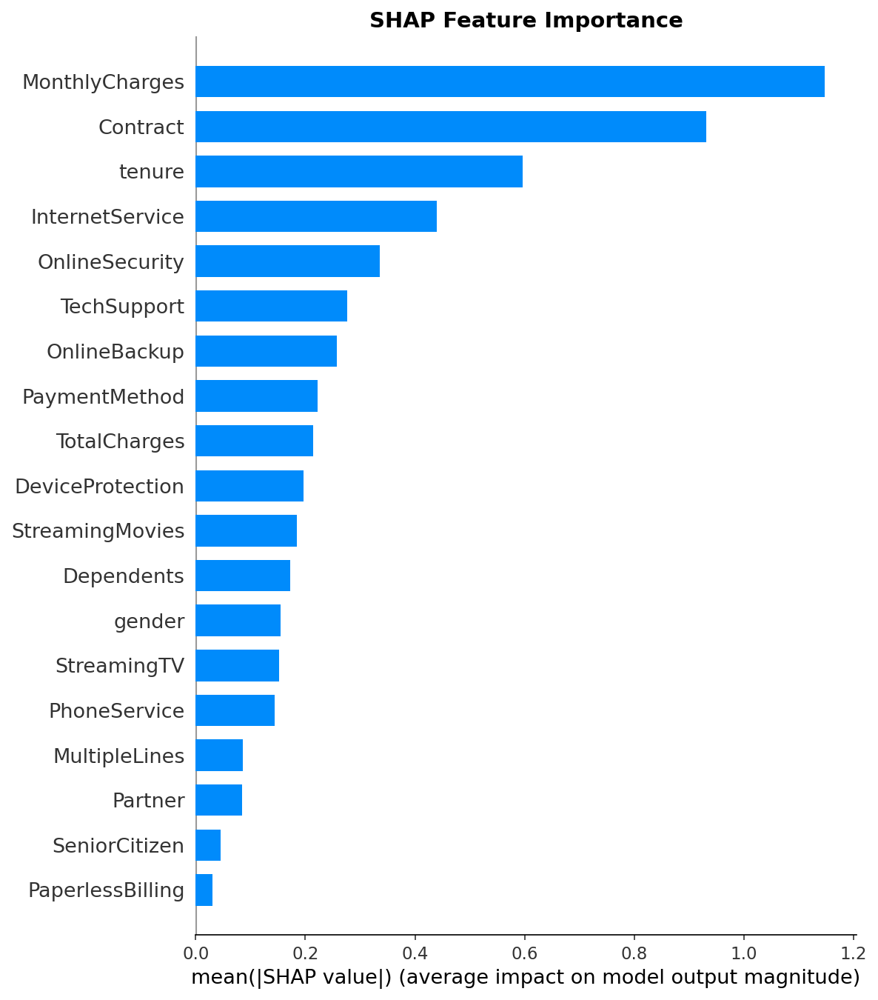
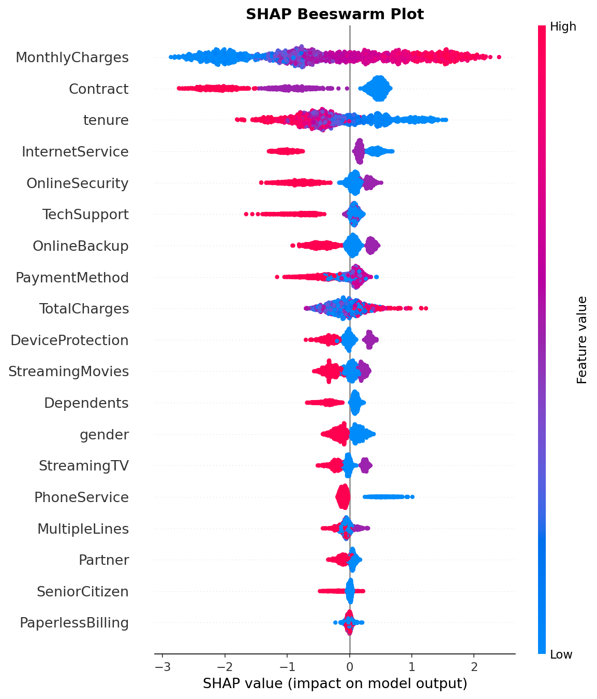

# Telco Customer Churn Prediction

[]()
[]()
[]()
[]()

Predict customer churn for a telecommunications company using **Random Forest** and **XGBoost** classifiers with SMOTE-balanced training data and SHAP-based model interpretability.

---

## Dataset

**Source:** [IBM Telco Customer Churn Dataset](https://www.kaggle.com/datasets/blastchar/telco-customer-churn)

- **7043** customers, **21** features (demographics, account info, services)
- Target: `Churn` (Yes/No) — ~27% churn rate
- Mixed data types: numerical (`tenure`, `MonthlyCharges`, `TotalCharges`) and categorical (`Contract`, `InternetService`, `PaymentMethod`, etc.)

---

## Project Structure

```
.
├── data/
│   └── WA_Fn-UseC_-Telco-Customer-Churn.csv   # Raw dataset
├── models/
│   ├── random_forest_model.pkl                 # Trained Random Forest
│   └── xgboost_model.pkl                       # Trained XGBoost
├── notebooks/
│   └── churn_analysis.ipynb                    # Full analysis pipeline
├── outputs/
│   ├── churn_distribution.png
│   ├── numerical_distributions.png
│   ├── contract_vs_churn.png
│   ├── correlation_heatmap.png
│   ├── roc_curve.png
│   ├── confusion_matrix.png
│   ├── shap_bar.png
│   └── shap_beeswarm.png
├── requirements.txt
└── README.md
```

---

## Setup

```bash
# Clone & enter the project
cd CustomerChurnPrediction

# Create virtual environment
python3 -m venv venv
source venv/bin/activate

# Install dependencies
pip install -r requirements.txt
```

---

## Usage

Run the Jupyter notebook end-to-end:

```bash
jupyter notebook notebooks/churn_analysis.ipynb
```

The notebook covers: data loading → EDA → preprocessing → SMOTE balancing → model training → evaluation → SHAP interpretation → model export.

---

## Exploratory Data Analysis

### Churn Distribution



~27% of customers have churned — a **class-imbalanced** dataset.

### Numerical Feature Distributions



- **Tenure:** Churned customers have shorter tenure; loyal customers stay longer.
- **Monthly Charges:** Churned customers tend to have higher monthly charges.
- **Total Charges:** Churned customers have lower total charges (shorter tenure).

### Contract Type vs Churn



Month-to-month contracts show the highest churn; two-year contracts retain customers best.

### Correlation Heatmap



`tenure` and `TotalCharges` are strongly correlated; `MonthlyCharges` has moderate correlation with churn.

---

## Methodology

### Preprocessing
- Drop `customerID` (non-predictive)
- Convert `TotalCharges` to numeric; drop 11 rows with missing values
- Label-encode all categorical features
- **80/20 stratified train-test split** (5,625 train / 1,407 test)

### Class Imbalance Handling
**SMOTE** (Synthetic Minority Oversampling) applied to training data, producing a balanced set of 4,130 samples per class.

### Models

| Model | Hyperparameters |
|---|---|
| **Random Forest** | `n_estimators=200`, `max_depth=15`, `min_samples_split=5`, `min_samples_leaf=2`, `max_features='sqrt'` |
| **XGBoost** | `n_estimators=100`, `max_depth=6`, `learning_rate=0.1`, `subsample=0.8`, `colsample_bytree=0.8` |

---

## Results

### Performance Comparison

| Metric | Random Forest | XGBoost |
|---|---|---|
| **Accuracy** | 75.98% | **76.12%** |
| **AUC-ROC** | **0.8163** | 0.8133 |
| **Precision** | 0.5423 | **0.5461** |
| **Recall** | **0.6176** | 0.6016 |
| **F1-Score** | **0.5775** | 0.5725 |

Both models perform similarly. XGBoost edges ahead on accuracy, while Random Forest leads on AUC-ROC, recall, and F1.

### ROC Curves



AUC-ROC scores of ~0.81 indicate solid discriminative ability — both models effectively separate churners from non-churners.

### Confusion Matrix (XGBoost)



The model correctly identifies most non-churning customers but produces a notable number of false positives for the churn class.

### Classification Reports

```
Random Forest (Tuned):
              precision    recall  f1-score
       0       0.85      0.81      0.83
       1       0.54      0.62      0.58

XGBoost:
              precision    recall  f1-score
       0       0.85      0.82      0.83
       1       0.55      0.60      0.57
```

---

## Model Interpretation (SHAP)

### Feature Importance



The top-5 most influential features: **tenure**, **Contract**, **TotalCharges**, **MonthlyCharges**, and **InternetService**.

### Impact on Prediction



- **Low tenure** → higher churn probability
- **Month-to-month contracts** → higher churn probability
- **Higher MonthlyCharges** → higher churn probability
- **Fiber optic InternetService** → higher churn probability

---

## Technologies

| Library | Purpose |
|---|---|
| pandas, numpy | Data manipulation |
| matplotlib, seaborn | Visualization |
| scikit-learn | Preprocessing, RF, metrics |
| XGBoost | Gradient boosting classifier |
| imbalanced-learn | SMOTE oversampling |
| SHAP | Model interpretability |
| joblib | Model serialization |
| Jupyter | Interactive notebook |

---

## License

MIT
