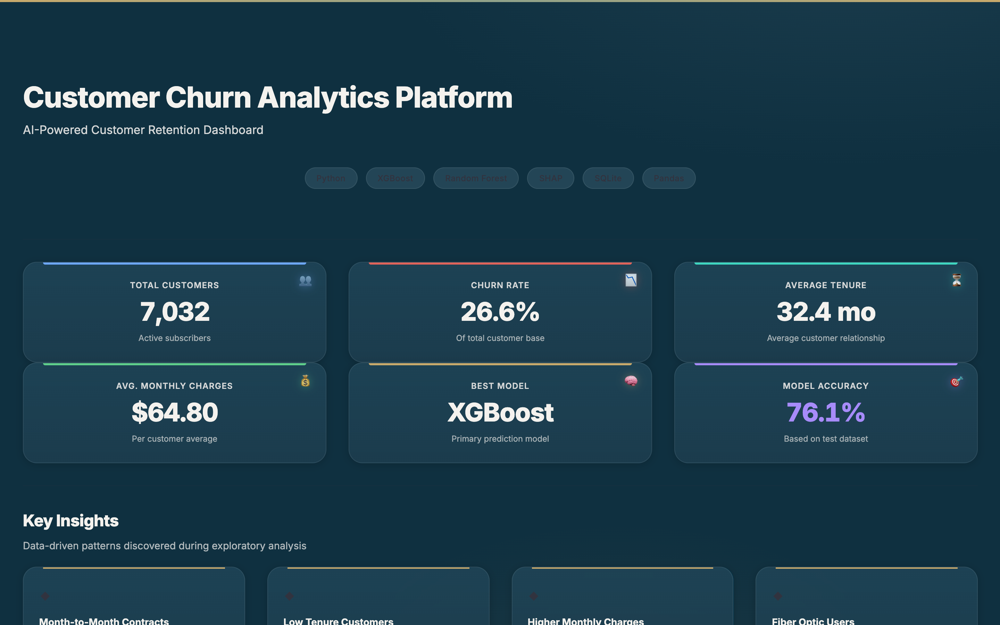
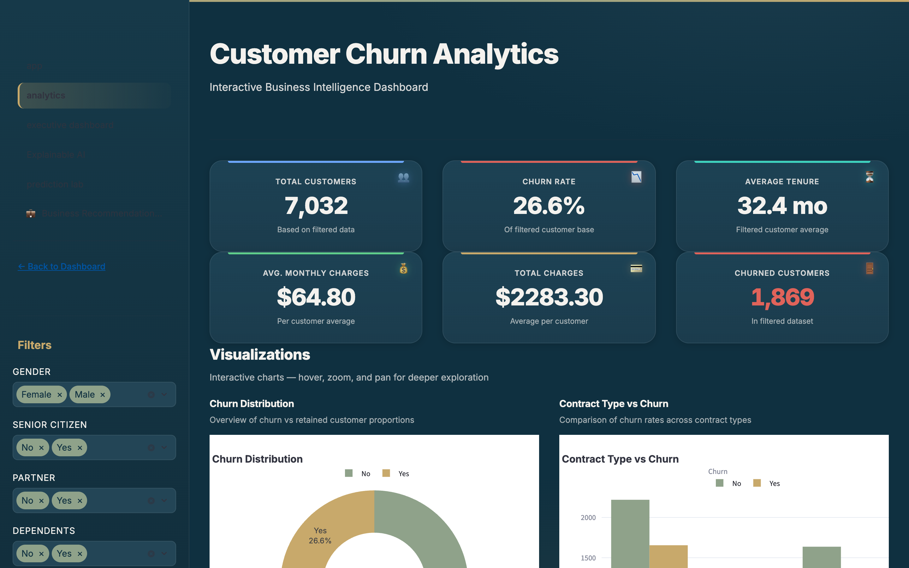
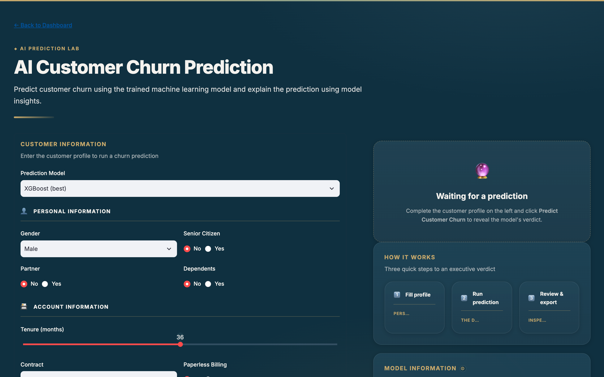
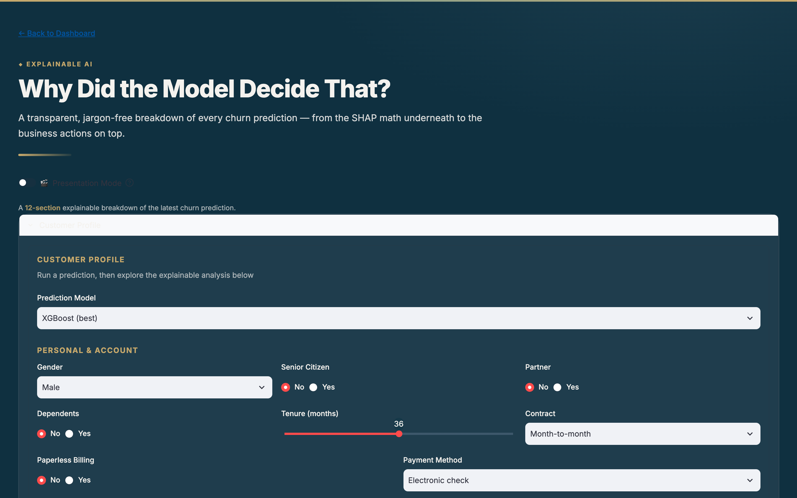
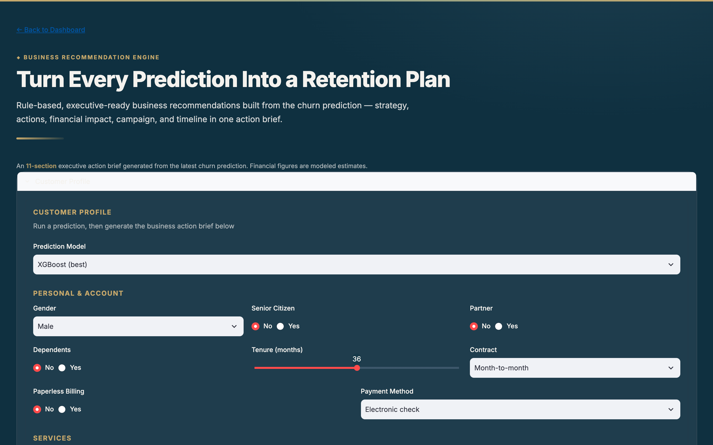
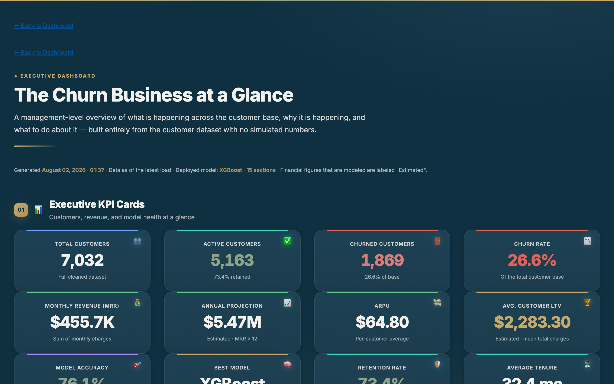

<div align="center">

# 📊 Customer Churn Prediction

### AI-Powered Customer Retention Analytics Platform

Predict customer churn for a telecommunications company using **XGBoost** and **Random Forest** classifiers with SMOTE-balanced training data, explain every prediction with **SHAP**, and act on it through a six-page interactive **Streamlit** executive dashboard with premium **PDF / PPTX / CSV** exports.

[](https://www.python.org/)
[](https://streamlit.io/)
[](https://scikit-learn.org/)
[](https://xgboost.ai/)
[](https://shap.readthedocs.io/)
[](https://plotly.com/)
[](https://github.com/abhinav7830tech/CustomerChurnPrediction)
[](LICENSE)

</div>

---

## 📑 Table of Contents

- [Features](#features)
- [Dashboard Screenshots](#dashboard-screenshots)
- [Technology Stack](#technology-stack)
- [Project Architecture](#project-architecture)
- [Folder Structure](#folder-structure)
- [Machine Learning Models](#machine-learning-models)
- [Dataset Information](#dataset-information)
- [Installation](#installation)
- [Requirements](#requirements)
- [Running Locally](#running-locally)
- [Streamlit Commands](#streamlit-commands)
- [Deployment](#deployment)
- [Export Features (PDF/PPT)](#export-features-pdfppt)
- [Future Improvements](#future-improvements)
- [Developer Information](#developer-information)
- [GitHub Repository](#github-repository)
- [License](#license)

---

## ✨ Features

| Page | Highlights |
|---|---|
| **🏢 Executive Dashboard** <br/>*(Home)* | Animated KPI cards with count-up counters, live churn-rate insights, model & technology badges, and one-click navigation to every tool. |
| **📈 Analytics** | Interactive business-intelligence dashboard with **7 real-time filters**, 6 live KPI cards, Plotly visualizations, a sortable data table, and auto-generated insights. |
| **🔮 AI Prediction Lab** | Single-customer churn prediction with model toggle (**XGBoost / Random Forest**), churn probability gauge, **Low / Medium / High** risk classification, top SHAP drivers, and personalized retention recommendations. |
| **🧠 Explainable AI** | SHAP **waterfall & factor analysis**, plain-language explanations, **what-if scenario simulation**, feature-importance table, and confidence assessment. |
| **💼 Business Recommendation Engine** | Rule-based business analysis: customer segmentation (VIP / Premium / Standard / High Risk / Critical), 0–100 business scorecards, **cost–benefit & ROI modeling**, prioritized action briefs, campaign plans, and account-manager notes. |
| **📋 Executive Dashboard (BI)** | CEO / management overview: health-score gauges, revenue-at-risk, department alerts, prioritized retention roadmap, executive summary, and board-brief notes. |

**Cross-cutting:**

- 🎨 Unified **navy & gold corporate design system** (`theme.py` + `theme.css`) shared across every page
- 📊 Consistent **dark Plotly template** with smooth transitions and hover tooltips
- 🚀 **Cached** data loading, model loading, and SHAP explainers for fast, repeatable sessions
- 📤 One-click **PDF, PPTX, CSV & TXT exports** (see [Export Features](#export-features-pdfppt))
- 📱 Responsive layout with a collapsible sidebar and mobile-friendly breakpoints

---

## 🖼️ Dashboard Screenshots

| Executive Dashboard (Home) | Analytics |
|---|---|
|  |  |

| AI Prediction Lab | Explainable AI |
|---|---|
|  |  |

| Business Recommendation Engine | Executive Dashboard (BI) |
|---|---|
|  |  |

---

## 🛠️ Technology Stack

| Layer | Technology |
|---|---|
| **Language** | Python 3.13+ |
| **Web Framework** | Streamlit (multipage app) |
| **Visualization** | Plotly, Matplotlib, Seaborn |
| **Machine Learning** | scikit-learn, XGBoost, imbalanced-learn (SMOTE) |
| **Interpretability** | SHAP (TreeExplainer) |
| **Data Handling** | pandas, NumPy |
| **Model Serialization** | joblib |
| **Export** | fpdf2 (PDF), python-pptx (PowerPoint) |
| **Notebooks** | Jupyter / IPython |

---

## 🏗️ Project Architecture

```mermaid
flowchart LR
    subgraph DATA["Data & Models"]
        DS[(data/ · IBM Telco CSV)]
        MOD[(models/ · RF + XGBoost .pkl)]
    end

    subgraph TRAIN["Training Pipeline (notebooks/)"]
        NB[churn_analysis.ipynb]
        PIPE["EDA · Preprocess · SMOTE · Train · Evaluate · SHAP"]
        NB --> PIPE --> MOD
    end

    subgraph CORE["Core Services (dashboard/)"]
        UTL[utils.py · load data & KPIs]
        PRED[prediction.py · inference · SHAP · recommendations]
        REP[report.py · PDF builder]
        PPT[pptx_report.py · deck builder]
    end

    DS --> UTL
    MOD --> PRED

    subgraph UI["Streamlit Pages"]
        APP[app.py · Entry (st.navigation)]
        H[dashboard/app.py · Home]
        A[Analytics]
        P[AI Prediction Lab]
        X[Explainable AI]
        B[Business Recommendation Engine]
        E[Executive Dashboard BI]
    end

    THEME[theme.py + theme.css · Design System]

    APP --> THEME
    UTL --> APP
    PRED --> APP
    APP --> H & A & P & X & B & E
    P --> REP & PPT
    B --> REP & PPT

    subgraph EXPORT["Exports"]
        REP --> PDF[(PDF)]
        PPT --> PPTX[(PPTX)]
        A --> CSV[(CSV)]
    end
```

**Flow:** The raw dataset feeds `utils.py` (live KPIs) and the pre-trained models feed `prediction.py` (inference + SHAP + recommendations). Every Streamlit page consumes these shared services plus the `theme.py` design system, and the Prediction Lab / Recommendation Engine can render their results into branded **PDF** and **PowerPoint** deliverables entirely in memory.

---

## 📂 Folder Structure

```
CustomerChurnPrediction/
├── app.py                                  # ⭐ Production entry point — st.navigation (sidebar nav)
├── dashboard/                              # Main Streamlit application
│   ├── app.py                              # Home page — Executive Dashboard (live KPIs)
│   ├── theme.py                            # Design system — tokens, CSS, Plotly template, widgets
│   ├── theme.css                           # Shared stylesheet (navy/gold corporate theme)
│   ├── utils.py                            # Data loading, cleaning & KPI calculators
│   ├── prediction.py                       # Model loading, inference, SHAP factors, recommendations
│   ├── report.py                           # Premium PDF report builder (fpdf2)
│   ├── pptx_report.py                      # Executive PowerPoint builder (python-pptx)
│   └── pages/
│       ├── analytics.py                    # Interactive BI dashboard (7 filters + CSV export)
│       ├── prediction_lab.py               # Single-customer AI prediction (PDF / PPTX export)
│       ├── Explainable_AI.py               # SHAP decision reports + what-if analysis (PDF)
│       ├── 💼_Business_Recommendation_Engine.py  # Rule-based action briefs (PDF / PPTX)
│       └── executive_dashboard.py          # CEO / management BI overview (PDF / PPTX / TXT)
├── models/                                 # Pre-trained pickled models
│   ├── random_forest_model.pkl
│   └── xgboost_model.pkl
├── notebooks/
│   └── churn_analysis.ipynb                # Full EDA → train → evaluate → SHAP pipeline
├── outputs/                                # EDA & model evaluation plots (PNG)
├── data/
│   └── WA_Fn-UseC_-Telco-Customer-Churn.csv  # Raw dataset
├── docs/
│   ├── screenshots/                        # Dashboard screenshots used in this README
│   ├── PERFORMANCE_REPORT.md               # Phase 9.0.5 performance optimization report
│   └── DEPLOYMENT_READINESS_REPORT.md      # Phase 9.0.6 deployment readiness report
├── requirements.txt
├── LICENSE
└── README.md
```

---

## 🤖 Machine Learning Models

Two gradient-boosted tree models were trained on SMOTE-balanced data and compared on a held-out **20% test set**:

| Model | Accuracy | AUC-ROC | Precision | Recall | F1-Score |
|---|---|---|---|---|---|
| **Random Forest** | 75.98% | **0.8163** | 0.5423 | **0.6176** | **0.5775** |
| **XGBoost** | **76.12%** | 0.8133 | **0.5461** | 0.6016 | 0.5725 |

> **XGBoost** is the default deployed model (best accuracy); **Random Forest** edges ahead on AUC-ROC, recall, and F1.

### Hyperparameters

| Model | Key Parameters |
|---|---|
| **Random Forest** | `n_estimators=200`, `max_depth=15`, `min_samples_split=5`, `min_samples_leaf=2`, `max_features='sqrt'` |
| **XGBoost** | `n_estimators=100`, `max_depth=6`, `learning_rate=0.1`, `subsample=0.8`, `colsample_bytree=0.8` |

### Training Pipeline

1. **Clean** — drop `customerID`; coerce `TotalCharges` to numeric; drop 11 rows with nulls.
2. **Encode** — label-encode all categorical features.
3. **Split** — stratified **80 / 20** train–test split (5,625 train / 1,407 test).
4. **Balance** — apply **SMOTE** oversampling to the training set (4,130 samples per class).
5. **Train & Tune** — train Random Forest and XGBoost with tuned hyperparameters.
6. **Evaluate** — accuracy, precision, recall, F1, confusion matrix, ROC-AUC.
7. **Explain** — SHAP `TreeExplainer` for global and per-customer feature attribution.
8. **Export** — serialize both models with `joblib` into `models/`.

### Interpretability (SHAP)

The dashboard surfaces the **top-5 SHAP factors** behind every single-customer prediction:

- 📉 **Low tenure** → higher churn probability
- 📝 **Month-to-month contracts** → higher churn probability
- 💳 **Higher MonthlyCharges** → higher churn probability
- 🌐 **Fiber optic InternetService** → higher churn probability
- 💰 **TotalCharges** — strong proxy for customer lifetime value

---

## 📊 Dataset Information

**Source:** [IBM Telco Customer Churn Dataset](https://www.kaggle.com/datasets/blastchar/telco-customer-churn) (Kaggle)

| Attribute | Details |
|---|---|
| **Records** | 7,043 customers |
| **Features** | 21 (demographics, services, account & billing) |
| **Target** | `Churn` (Yes / No) — ~27% churn rate |
| **Types** | Mixed — numeric & categorical |

**Feature groups:**

- 👤 **Demographics:** `gender`, `SeniorCitizen`, `Partner`, `Dependents`, `tenure`
- 📡 **Services:** `PhoneService`, `MultipleLines`, `InternetService`, `OnlineSecurity`, `OnlineBackup`, `DeviceProtection`, `TechSupport`, `StreamingTV`, `StreamingMovies`
- 📇 **Account:** `Contract`, `PaperlessBilling`, `PaymentMethod`
- 💳 **Billing:** `MonthlyCharges`, `TotalCharges`

---

## 🚀 Installation

```bash
# 1. Clone the repository
git clone https://github.com/abhinav7830tech/CustomerChurnPrediction.git
cd CustomerChurnPrediction

# 2. Create & activate a virtual environment
python3 -m venv venv
source venv/bin/activate        # Windows: venv\Scripts\activate

# 3. Install dependencies
pip install -r requirements.txt
```

---

## 📦 Requirements

All dependencies are pinned loosely in [`requirements.txt`](requirements.txt):

| Library | Purpose |
|---|---|
| `streamlit` | Web application framework (multipage UI) |
| `plotly` | Interactive BI visualizations |
| `pandas`, `numpy` | Data manipulation & numerical computing |
| `matplotlib`, `seaborn` | Static EDA visualizations |
| `scikit-learn` | Preprocessing, Random Forest, metrics |
| `xgboost` | Gradient-boosted classifier |
| `imbalanced-learn` | SMOTE oversampling |
| `shap` | Model interpretability |
| `joblib` | Model serialization |
| `fpdf2` | PDF report export |
| `python-pptx` | PowerPoint deck export |

> 💡 `jupyter` / `ipykernel` are notebook-only and intentionally **not** in
> `requirements.txt` (kept out of the deployment image). Install them manually
> to run `notebooks/churn_analysis.ipynb`: `pip install jupyter ipykernel`.

---

## ▶️ Running Locally

```bash
# From the project root, launch the dashboard
streamlit run app.py
```

Open the browser to **http://localhost:8501** — the **Home** page loads first, with all five additional tools available from the sidebar (`🏠 Home · 📊 Analytics · 🧪 Prediction Lab · 🧠 Explainable AI · 💼 Business Recommendation Engine · 📈 Executive Dashboard`).

> ⚠️ Run the app from the **project root** (`CustomerChurnPrediction/`) so the `data/` and `models/` paths resolve correctly.

### Optional — run the analysis notebook

```bash
pip install jupyter ipykernel   # notebook-only dependencies
jupyter notebook notebooks/churn_analysis.ipynb
```

The notebook walks the full pipeline: data loading → EDA → preprocessing → SMOTE balancing → model training → evaluation → SHAP interpretation → model export.

---

## 🖥️ Streamlit Commands

```bash
# Standard launch
streamlit run app.py

# Launch on a custom port
streamlit run app.py --server.port 8602

# Expose on your network (e.g. for local LAN access)
streamlit run app.py --server.address 0.0.0.0

# Headless mode (no browser auto-open) — handy for servers
streamlit run app.py --server.headless true

# Stop the running server
#   Press Ctrl+C in the terminal

# Clear cached data / models (after updating a dataset or model)
streamlit cache clear
```

**Common flag reference:**

| Flag | Purpose |
|---|---|
| `--server.port` | Change the port (default `8501`) |
| `--server.address` | Bind address (default `localhost`) |
| `--server.headless true` | Run without auto-opening a browser |
| `--browser.gatherUsageStats false` | Disable usage statistics |

---

## 🚀 Deployment

The project is **deployment-ready** — verified end-to-end in
[`docs/DEPLOYMENT_READINESS_REPORT.md`](docs/DEPLOYMENT_READINESS_REPORT.md):
all 6 pages render with zero errors, every PDF / PPTX / CSV / TXT export works,
and no blocking issues were found.

| Platform | Entry point | Start command |
|---|---|---|
| **Streamlit Cloud** | `app.py` | Auto-installs `requirements.txt`; pick the file in the dashboard |
| **Render** (Web Service) | `app.py` | `streamlit run app.py --server.address 0.0.0.0 --server.port $PORT` |
| **Railway** | `app.py` | `streamlit run app.py --server.address 0.0.0.0 --server.port $PORT` |

> ⚠️ **Set the Main file path to `app.py` on Streamlit Cloud.** It is the
> production entry point — it builds the sidebar navigation and routes every
> page via `st.navigation` / `st.Page`. Root-level `runtime.txt` (`3.13.3`)
> pins the cloud Python runtime and `requirements.txt` pins `numba==0.66.0` /
> `llvmlite==0.48.0`, which ship **Python 3.14** wheels so SHAP installs cleanly
> on the cloud's default runtime too.

---

## 📤 Export Features (PDF/PPT)

Every report is generated **in memory** and delivered as a branded, downloadable file — styled to match the navy & gold dashboard theme.

| Page | Exports | Format |
|---|---|---|
| **Analytics** | Filtered dataset | 📄 **CSV** |
| **AI Prediction Lab** | Executive customer retention report | 📄 **PDF** · 🖥️ **PPTX** |
| **Explainable AI** | SHAP decision report | 📄 **PDF** |
| **Business Recommendation Engine** | Executive report + action briefs | 📄 **PDF** · 🖥️ **PPTX** |
| **Executive Dashboard (BI)** | Board report + deck + summary | 📄 **PDF** · 🖥️ **PPTX** · 📝 **TXT** |

**What's inside the PDF/PPTX deliverables:**

- Dedicated **cover page** with brand header, verdict, and metadata
- **Executive summary** — prediction, risk level, probability, revenue at risk & CLV
- **Customer details** — full profile used for the prediction
- **KPI summary** — probability, risk, priority, segment, cost–benefit & ROI
- **Business recommendations** — prioritized actions with rationale, impact & cost
- **Conclusion & next steps** with account-manager notes

> Exports never recompute or alter any prediction, SHAP, or business metric — they only format existing results for print.

---

## 🔮 Future Improvements

- 🔬 **Hyperparameter optimization** (Optuna) and model ensemble / stacking
- 🌐 **Live deployment** — push the verified-ready app to Streamlit Community Cloud / Render / Railway (see [Deployment](#deployment))
- 🗄️ **Live data source** — Postgres / API integration instead of a static CSV
- ⏰ **Batch churn scoring** and scheduled PDF/PPTX distribution
- 🧪 **A/B testing** of retention offers and campaign ROI tracking
- 📈 **Model drift monitoring** with an automated retraining pipeline
- 🔐 **Authentication & role-based access** (analyst / manager / executive)
- ✅ **Automated test suite** (unit + UI) and code-quality gates

---

## 👤 Developer Information

**Abhinav Agnihotri** — Data Science & Machine Learning

- 🧑‍💻 **GitHub:** [abhinav7830tech](https://github.com/abhinav7830tech)
- 📌 **Role:** Data Scientist / ML Engineer (College Project — Sprint 2)

Built as a full-stack data science project: end-to-end ML pipeline (EDA → training → interpretation) wrapped in a production-grade executive dashboard.

---

## 🔗 GitHub Repository

- 📂 **Repository:** [github.com/abhinav7830tech/CustomerChurnPrediction](https://github.com/abhinav7830tech/CustomerChurnPrediction)
- ⭐ Found it useful? Give it a **star**!
- 🍴 Want to contribute? Feel free to **fork** and open a **pull request**.

---

## 📄 License

Distributed under the **MIT License**. See [`LICENSE`](LICENSE) for more information.

---

<div align="center">
  <sub>Built with ❤️ using Streamlit · Plotly · scikit-learn · XGBoost · SHAP</sub>
</div>
